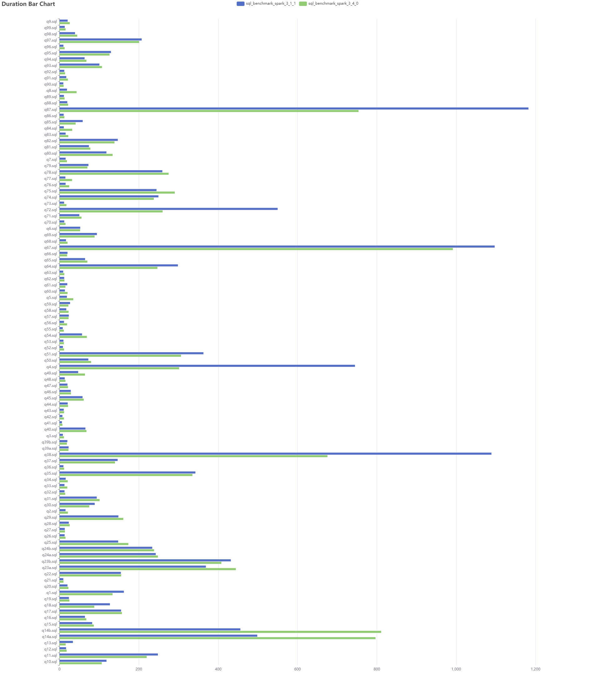

## 大数据 SQL 基准测试

整理大数据 SQL 基准测试步骤和一些脚本

## 生成基准测试数据

### Apache Kyuubi 基准测试插件

Kyuubi 1.6+ 中提供了集成 [tpcds](https://github.com/apache/kyuubi/tree/master/extensions/spark/kyuubi-spark-connector-tpcds)、[tpch](https://github.com/apache/kyuubi/tree/master/extensions/spark/kyuubi-spark-connector-tpch) 数据集的 Spark Connector 插件，可在查询时实时生成数据集。 我们也可以使用它来快速生成基准测试的数据集。

#### 使用

将 kyuubi-spark-connector-tpcds_XXX-SNAPSHOT.jar 包复制到 $SPARK_HOME/jars 中 ,
在 spark-default.conf 中配置 catalog：`spark.sql.catalog.tpcds=org.apache.kyuubi.spark.connector.tpcds.TPCDSCatalog`。
这样我们就可以直接通过 tpcds catalog 访问 tpcds 数据。

例子：

```sql
-- 显示数据库（不同数据量）
SHOW DATABASES IN tpcds;

-- 显示表
SHOW TABLES IN tpcds.sf1;

-- 查询表
USE tpcds.sf1;
SELECT * FROM orders;
```

#### 持久化数据

Kyuubi tpcds/tpch 数据集插件，是在读取时生成数据，适合做一些简单的测试。进行 SQL 基准测试时，最好还是将数据持久化成指定格式的文件。

[sql/generate/kyuubi/tpcds_tables_generate.sql](sql/generate/kyuubi/tpcds_tables_generate.sql) 是一个持久化 tpcds 数据集的 SQL，可直接通过 beeline 执行此 SQL 文件进行持久化：

```
beeline -u "jdbc:hive2://hostname:10000/default;?spark.yarn.queue=${QUEUE};spark.sql.catalog.tpcds=org.apache.kyuubi.spark.connector.tpcds.TPCDSCatalog" \
  --hivevar DB=tpcds_1000 --hivevar FILE=parquet --hivevar SOURCE_NS=tpcds.sf1000 \
  -f sql/generate/kyuubi/tpcds_tables_generate.sql
```

### 其他工具

+ tpcds-kit: [tpcds-kit](tpcds-kit)
+ hive-testbench: [https://github.com/hortonworks/hive-testbench](https://github.com/hortonworks/hive-testbench)
+ HiBench: [https://github.com/Intel-bigdata/HiBench](https://github.com/Intel-bigdata/HiBench)

## 执行基准测试 SQL

数据生成好后，我们就可以执行基准测试的 SQL 文件。

### 执行基准测试脚本

[bin/run_with_beeline.sh](bin/run_with_beeline.sh)：用于批量执行 SQL 文件并生成报告。

使用：

```
# 指定 SQL 文件目录（默认为 $work_dir/sql/tpcds）
# export SQL_DIR=sql/tpcds

bin/run_with_beeline.sh -u "jdbc:hive2://hostname:10000/default;?spark.yarn.queue=${QUEUE};"

# 生成报告在 $work_dir/report 目录中
```

### 生成柱状图

```
python bin/gen_chart.py report/examples/aqe_001/sql_benchmark_spark_3_1_1.report report/examples/aqe_001/sql_benchmark_spark_3_4_0.report report/examples/aqe_001/aqe_001.html
```

