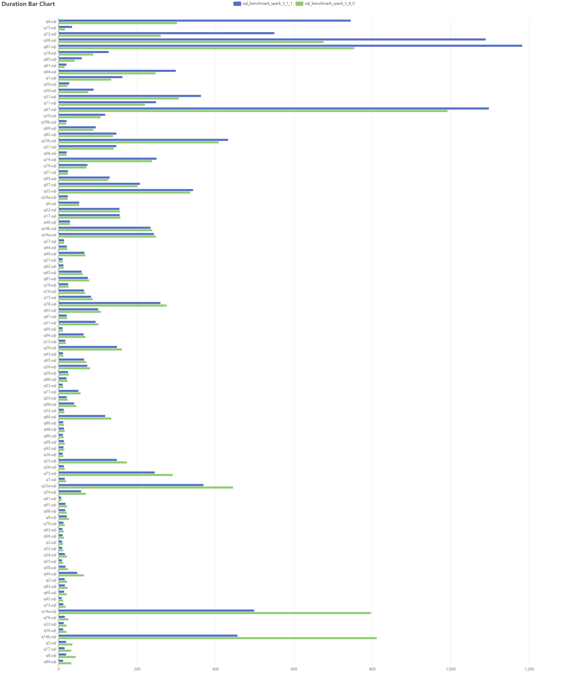
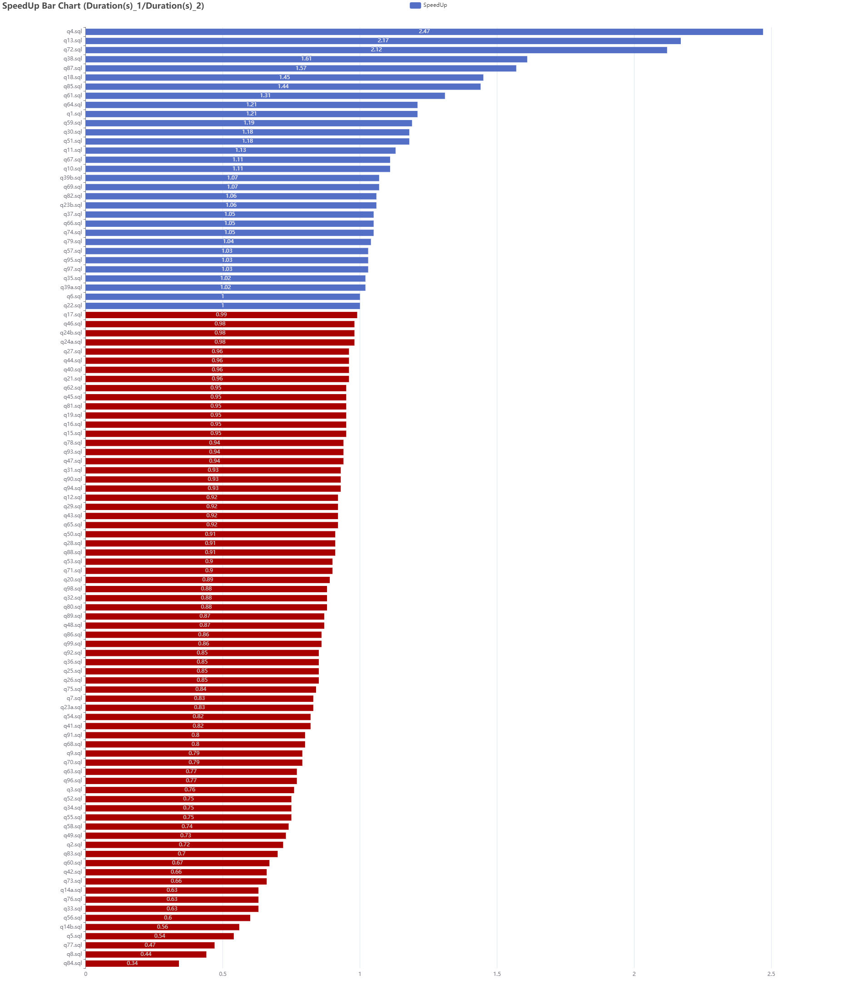

Running tpcds (sf1000: 250GB) benchmarks with kyuubi + spark (3.1.1/3.4.0) .

**NOTE: This is not a positive example. The spark 3.4 benchmark performance regression caused by too large `spark.sql.adaptive.advisoryPartitionSizeInBytes` setting.**

Configuration:

```
kyuubi.engine.share.level	USER

spark.driver.memory	3G
spark.executor.memory	3G
spark.executor.instances	500
spark.dynamicAllocation.enabled	false
spark.shuffle.service.enabled	true

spark.sql.files.maxPartitionBytes	256MB
spark.sql.adaptive.enabled	true
spark.sql.adaptive.advisoryPartitionSizeInBytes	1024M
spark.sql.adaptive.coalescePartitions.minPartitionNum	1
```

Result:




