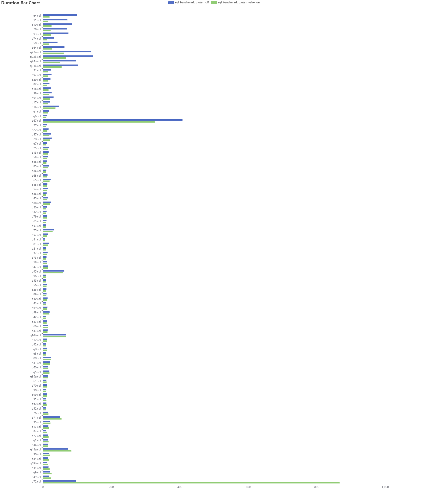
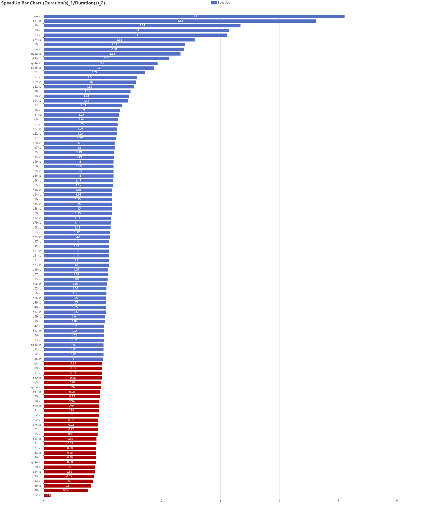

Running tpcds (sf1000: 250GB) benchmarks with gluten + spark 3.3.2 .

Gluten Project: [https://github.com/oap-project/gluten](https://github.com/oap-project/gluten)

Configuration:

```
kyuubi.engine.share.level	USER

spark.driver.memory	3G
spark.executor.memory	3G
spark.executor.instances	500
spark.dynamicAllocation.enabled	false
spark.shuffle.service.enabled	true

spark.sql.files.maxPartitionBytes	256MB
spark.sql.adaptive.enabled	true

spark.plugins=io.glutenproject.GlutenPlugin;
spark.gluten.sql.columnar.backend.lib=velox;
spark.gluten.loadLibFromJar=true;
spark.shuffle.manager=org.apache.spark.shuffle.sort.ColumnarShuffleManager;
spark.memory.offHeap.enabled=true;
spark.memory.offHeap.size=2g;
spark.executorEnv.LIBHDFS3_CONF=hadoop-test.xml;
spark.gluten.generate.libhdfs3.conf.auto=true
```

Result:




